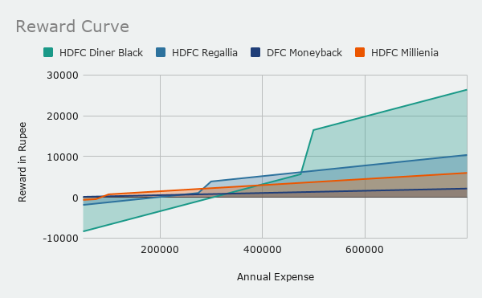

> The universe will reward you for taking risks on its behalf.
 
— Shakti Gawain

Hello fellow Tribemember,

Ahh!! the lovely topic of credit cards, This is one of my favourite financial instrument. If used wisely it provide discounts, reward points, 45 days free credit and ease of transaction and improves your credit rating. But, If Used Wisely.* 

In this article, I am going to present a very diffent way to buy credit cards using **Reward Ratio** and **Reward Curve** . So, read till the end.

Choosing a correct credit card which matches your expenses allows you to earn money for free.

### How people select credit card.
People take credit card in Two ways, either they call the bank's representative or bank's representative calls them. Doesn't matter which way you go, you always end up the same. The executive will always sell you the card, which has the highest commission for him.

Executive's goal is always the opposite of yours, He is there to lure you to buy the most exepensive card you are eligible for. That's the biggest mistake you will do.

### What are the tricks.
* Check if you can increase your credit usage, by including things like rent, tution fee, Insurance, this way you will be able to take a high end card
* Check the special reward offered by credit cards and choose the one which translate into more savings to you. If you don't like to travel, A voucher to thailand is useless to you.
* Always go with the Reward Ratio, as that is the guaranteed reward you will get on your card. 

### How to choose a credit card.
As I mentioned in the beggining, the biggest mistake any person do is to listen to the bank's executive and buys the card he is offering. Lack of knowledge would be your biggest mistake, while buying the credit card.

While choosing the credit card you must focus on the following aspect. In the same priority

1. Eligibility Criteria.
2. The Cost of ownership.
3. The Reward Ratio of Credit Card.
4. Benefits

Make sure you follow the order of priority here.

#### Eligibility criteria.
You can not apply for any card randomly, before applying for the card find about the eligibility criteria of the card. To find this always follow the bank's website, since this keeps on changing, relying on third party website is waste of time.

As a step 1 of your search, find the list of all cards for which you are eligible. Sometime bank flex rules for existing customer, So if you do not fulfill the criteria by few percentage, you can always ask the bank's executive. But, call him only after you do the homework given here.

Inquiring for cards affect your credit score negatively.

#### Cost of ownership.
Once you have the list of cards for which are eligible, Now let's rule out the cards that you can not afford. Go to your bank's website and fetch all the transaction you have done from your card in last 1 year.

Why are still reading?? :angry: Go get the data, you dummy!!

Good! :kissing_heart: So now we are friends again.

To find the cost of ownership, let's find the minimum spend required to waive off the annual renewal fee. It is normally present in card's features.

Remove every card from the list where

\[Annual Spend From Card < Minimum Spend Required\]

#### Reward Ratio
Now we are left with only those cards, for which we are worthy. It is time to choose the card which is best for us.
Most of the bank provide the information, that how much reward point you will earn on each transaction. But there is a loophole.

Number of reward point is irrlevent to us, because the value of reward point varies from bank to bank and card to card. Therefore it is best to convert these reward point in actual currency.

For example HDFC bank provides Two card <i>Diners Club Black and Moneyback</i>, one has 1 RP = 1 Rupee, other 1 RP = 20 paisa!!

<i>RewardConversionRatio = Value of Reward point in terms of rupee.<i>
 
<i>Reward Point = Number of Reward point per transaction<i>
 
<i>One Transaction Unit = Minimum Transaction required to earn reward point.<i>

\[ Reward Ratio = RewardConversionRate\left( Reward Point \over One Transaction Unit \right) \]

Therfore, if your card gives you 2 RP on spending 150 Rupee, and 1 RP = 20 paisa,

\[ Reward Ratio = 0.2\left( 2\over 150 \right)  = .0026
 \] 

#### Choosing point
Sometimes you may find that the reward of one card over shadows the other cards by a huge margin. In that case you must use the Reward Curve of the card and find if buy using your card in few more transaction can you reach the annual limit of the new card .

 

<i>You can use the excel sheet given below to plot this curve<i>

In the above example it is cleary visible that Diner's Club Black is a clear winner than the other card, excpet the Diners privilage. But if you spend above 5 Lakh an year, the reward difference is huge and it is plain stupidity to go for the other cards. For some cases the Diner's Black offer upto 33% reward point, So check if that applies to you.

#### Excel Sheet
You can use the format given in excel sheet to find the card best for you.
[Link of Excel sheet to compare cards](https://docs.google.com/spreadsheets/d/1xazjyv3SvSoYOSZ3s16xlSvwjWnQtAqffQHV2EN40rg/edit?usp=sharing)